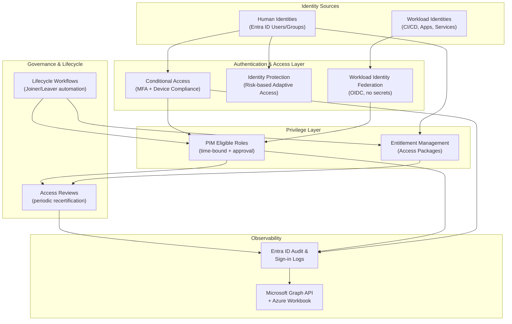
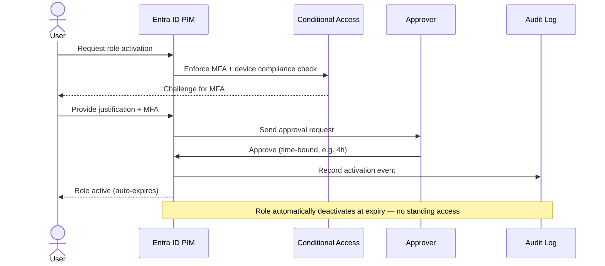
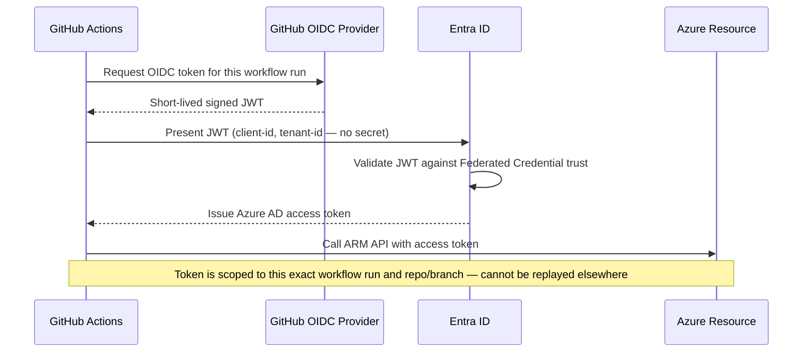

# Zero-Trust Identity Governance Platform on Microsoft Entra ID

**Eliminating long-lived static credentials and enforcing least-privilege, time-bound access for both human and non-human identities.**

`Microsoft Entra ID` `PIM` `Conditional Access` `Identity Protection` `Workload Identity Federation` `Entitlement Management` `Lifecycle Workflows` `Microsoft Graph API` `GitHub Actions OIDC` `PowerShell` `Python`

---

## Overview

This project implements an end-to-end identity governance architecture across Microsoft Entra ID, covering all four domains of Microsoft's SC-300 (Identity and Access Administrator) skills framework: identity management, authentication & access, application access, and identity governance.

The core design principle: **credentials should be short-lived, and privilege should be earned on demand — never standing.** Every component in this project traces back to that single idea, applied to a different layer of the identity stack.

**Key outcomes:**

| Metric | Before | After |
|---|---|---|
| CI/CD credential type | Long-lived client secret | OIDC token (~1hr lifetime, zero stored secrets) |
| Privileged roles as Permanent Active | 100% | 0% (all converted to PIM Eligible) |
| Average privilege activation time | Manual, ad hoc | Minutes, with enforced approval + MFA |
| Offboarding → full access revocation | Manual, days | Automated, minutes |
| MFA registration coverage | Baseline | +XX% |

---

## Architecture



### Privilege activation flow (PIM)



### Zero-secret CI/CD authentication (Workload Identity Federation)



---

## Technology Stack

| Layer | Technology | Purpose |
|---|---|---|
| Identity Platform | Microsoft Entra ID (P2) | Core directory, PIM, Access Reviews require P2 |
| Privileged Access | Entra ID PIM | Time-bound, approval-gated role activation |
| Conditional Access | Entra ID Conditional Access | Risk-adaptive authentication enforcement |
| Risk Detection | Entra ID Identity Protection | User/sign-in risk scoring |
| Workload Identity | Federated Credentials + GitHub Actions OIDC | Secret-free CI/CD authentication |
| Entitlement Management | Access Packages, Catalogs | Self-service access with approval + expiry |
| Lifecycle Automation | Lifecycle Workflows | Automated joiner/leaver processing |
| Automation & Reporting | Microsoft Graph API (Python `msgraph-sdk`, PowerShell) | Data extraction, scripted validation |
| Observability | Azure Workbook / Power BI, Log Analytics | Metrics dashboard, audit trail |
| CI/CD | GitHub Actions | Deployment pipeline, OIDC token issuance |

---

## What This Project Demonstrates

**1. Application access management** — Zero-secret Workload Identity Federation between GitHub Actions and Entra ID via OIDC, replacing long-lived client secrets with per-run federated tokens scoped to a specific repository, branch, and environment.

**2. Adaptive authentication & access** — A layered Conditional Access policy set (baseline MFA, privileged-role hardening, risk-based response, legacy auth blocking, unmanaged device restriction) integrated with Identity Protection risk signals, with a protected break-glass account excluded from all policies.

**3. Privileged access governance** — Conversion of high-privilege roles from Permanent Active to PIM Eligible, with enforced MFA, approval workflows, and maximum activation duration — directly tied into Conditional Access for defense-in-depth.

**4. Identity lifecycle governance** — Full Access Package lifecycle (request → approval → time-bound grant → automatic expiry/recertification) and an automated Leaver workflow that disables accounts, revokes tokens, and strips group/role/PIM assignments within minutes of an offboarding trigger.

**5. Observability** — Metrics pulled via Microsoft Graph API (PIM activation logs, role assignment mix, MFA coverage, risky sign-in counts) visualized in an Azure Workbook, quantifying the before/after impact of each change.

---

## Design Decisions & Trade-offs

- **Why Workload Identity Federation over Managed Identity for CI/CD:** Managed Identity only works for Azure-hosted resources; Federation extends the same secret-free model to external platforms like GitHub Actions, making it the more general zero-credential pattern.
- **Why risk signals are configured inside Conditional Access rather than legacy Identity Protection policies:** Microsoft's current guidance consolidates risk-based conditions into Conditional Access for a single, unified policy surface rather than two separate enforcement points.
- **Why Eligible (not Permanent Active) for every sensitive role:** Standing privilege is the single largest reduction in blast radius available without impacting legitimate work — the cost is a few seconds of activation friction per use.

---

## Evidence & Screenshots

*(Embed screenshots here from your evidence folder, e.g.)*

```markdown

*Privileged role converted from Permanent Active to Eligible, with 4-hour max activation and mandatory approval.*
```

---

## Alignment with SC-300 (Identity and Access Administrator)

| SC-300 Domain | Project Component |
|---|---|
| Implement identity management solutions | User/group provisioning via Graph API |
| Implement authentication and access management | Conditional Access policy set + Identity Protection |
| Implement access management for apps | Workload Identity Federation, App Registration scoping |
| Plan and implement identity governance | PIM, Entitlement Management, Access Reviews, Lifecycle Workflows |

---

## Repository

`[link to GitHub repo]`

## Related Project

See also: **[Cloud Security Baseline Automation & Compliance Pipeline](#)** — the infrastructure-side counterpart to this identity-side project, together forming a complete cloud security engineering narrative (infra compliance + identity governance).
